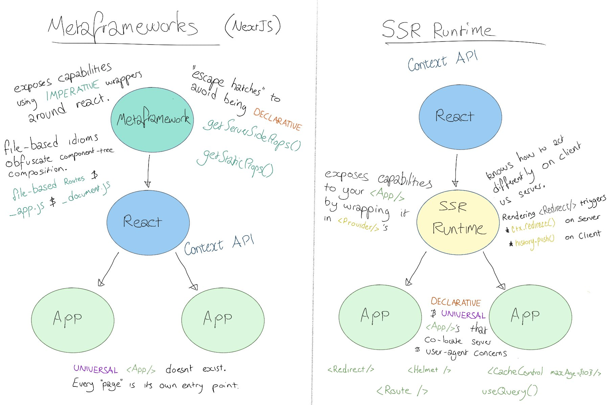

# React SSR - Runtime vs Metaframework

The goal of this document is to elaborate on how (and why) the React SSR in this project functions. It is partially based on [this](https://twitter.com/pseudo_su/status/1294609747438497792?s=20) twitter thread.



## Having a universal `<App />`

TODO

## ui = fn(state) applied to Server-rendering contexts

WIP

* When rendering on the client we often think about the `ui` aspect of `ui = fn(state)` to mean "the visible html rendered" (What the user sees).
* When applied to SSR contexts, the `ui` aspect of `ui = fn(state)` (UI is a function of state) should actually be understood as "Everything given to the User agent by the server" (everything the **user agent** sees).

## How to handle different implementation across server and client rendering contexts

WIP

```tsx
// app.js
function App() {
  const { sendError } = useErrorReporter();
  return (
    <button onClick={(e) => sendError(new Error("FOO!"))}>send error</button>
  );
}
// server.js
import { App } from "./app";
function AppWithProviders() {
  return (
    <NodeJSErrorReporterProvider>
      <App />
    </NodeJSErrorReporterProvider>
  );
}
// client.js
import { App } from "./app";
function AppWithProviders() {
  return (
    <BrowserErrorReporterProvider>
      <App />
    </BrowserErrorReporterProvider>
  );
}
```
